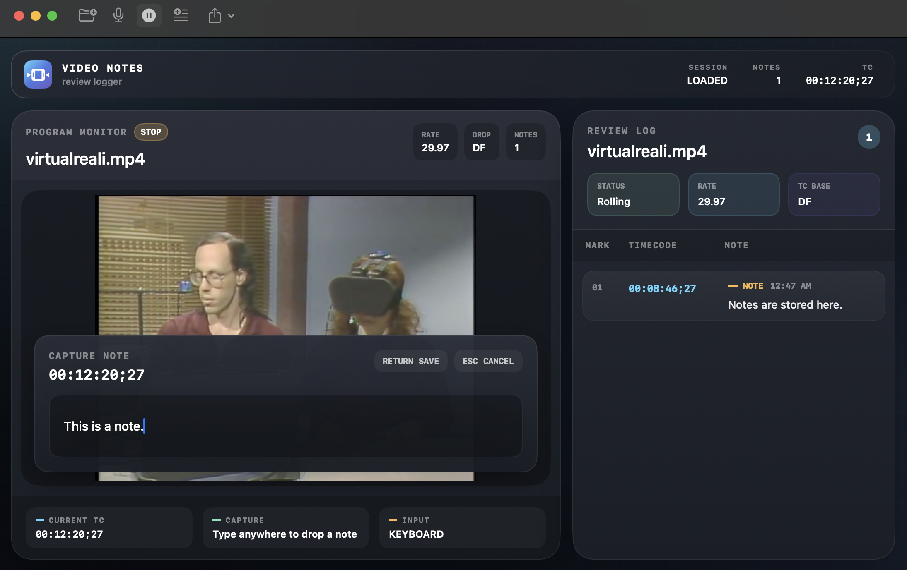

# VideoNotes

VideoNotes is a native Mac app for reviewing video and capturing clean, timecoded notes as you watch.

Instead of stopping to scrub around and type notes somewhere else, you can review the cut, press a key, and keep going. Every note is attached to the exact moment in the video, can include a frame thumbnail in PDF export, and can be exported for common editorial workflows.


## Why it is useful

VideoNotes is built for moments when you need to review footage quickly and come out with notes that are actually usable.

- Watch video and start typing immediately to create a timecoded note
- Use voice mode for hands-free review
- Export a readable PDF with frame thumbnails
- Export markers for Avid, Premiere, Resolve, or plain text
- Save a review session and reopen it later

## What it looks like

### Loaded project

This is the main review workspace once a clip is loaded.


### Notes view

Notes stay attached to timecode and are easy to jump back to.



## How it works

1. Open a video file.
2. Play the video.
3. Start typing to create a note at the current frame, or press `N` to add one manually.
4. Press `Enter` to save the note.
5. Export your notes when you are done.

## Export options

VideoNotes can export review notes in a few different ways depending on who needs them next.

| Export | Best for |
| --- | --- |
| PDF | Sharing, printing, client review, frame-based note sheets |
| Plain Text | Simple note lists |
| Avid SubCap | Avid Media Composer workflows |
| Premiere CSV | Adobe Premiere marker workflows |
| Resolve EDL | DaVinci Resolve marker import |

## Keyboard shortcuts

| Shortcut | Action |
| --- | --- |
| `Space` | Play or pause |
| `Cmd+O` | Open a video |
| `N` | Add a note manually |
| `E` | Export notes |
| `Enter` | Save current note |
| `Esc` | Cancel current note |
| Any printable key | Start a new note from the current frame |

## Voice notes

Voice mode lets you dictate notes while the video keeps playing. VideoNotes timestamps the note from when speech starts, so the exported note is tied to the right moment instead of the end of the sentence.

macOS will ask for microphone and speech recognition access the first time you use it.

## PDF export

The PDF export is designed to be readable, compact, and useful in real review sessions.

- Frame thumbnail on the left
- Timecode and note text on the right
- Print-friendly layout
- Great for sharing feedback with editors, producers, or clients

## Requirements

- macOS 14 or later
- Microphone access for voice mode
- Xcode 15 or later if you want to build from source

## Install and run

### Option 1: Build from Terminal

```bash
swift build
./build-app.sh
open VideoNotes.app
```

### Option 2: Open in Xcode

Open `Package.swift` in Xcode and run the app with `Cmd+R`.

## Supported video formats

VideoNotes uses Apple’s built-in playback stack, so it works with the formats macOS supports natively, including common `.mov` and `.mp4` files.

If you need DNxHD or DNxHR playback, install the [Avid codecs](https://www.avid.com/products/avid-codecs) on the Mac.

## Project structure

```text
Sources/VideoNotes/
├── App/
├── Models/
├── Services/
├── Utilities/
├── ViewModels/
└── Views/
```

## License

MIT
